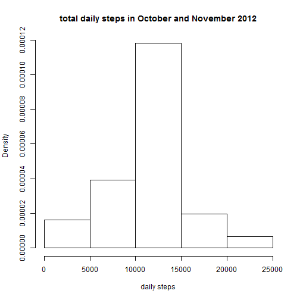
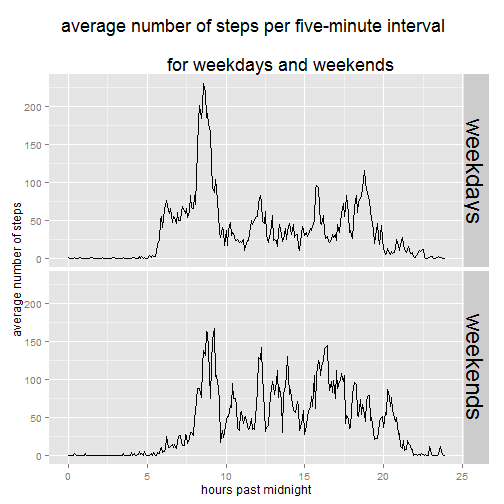

----
title: "Assignment 1 for Reproducible Research course"

output:
  html_document:
    keep_md: true
    
author: "Sumit Rahman"
date: "Saturday, November 14, 2015"
---


## Loading and preprocessing the data

The following code reads the data, aggregates it by day (excluding NAs) and generates a histogram showing the distribution of the daily total number of steps:


```r
activity <- read.table(unz("repdata-data-activity.zip", "activity.csv"), 
                       header=T, quote="\"", sep=",")
daily.steps<-aggregate(formula=steps ~ date, FUN=sum,data=activity, na.rm=TRUE)

hist(daily.steps$steps, freq=FALSE, 
     main="total daily steps in October and November 2012", 
     xlab="daily steps")
```

 


## What is mean total number of steps taken per day?

Next we calculate the mean and median number of steps per day:

```r
result1<-mean(daily.steps$steps)
result2<-median(daily.steps$steps)
```

The mean number of steps per day is 10766.19, and the median is 10765.


## What is the average daily activity pattern?
Now we take the mean number of steps for each 5 minute interval, averaged across all days, and plot this as a line graph:


```r
time.steps<-aggregate(formula=steps ~ interval, FUN=mean,data=activity, 
                      na.rm=TRUE)
plot(time.steps, type="l",main="average steps per five-minute interval", 
     xlab="minutes past midnight")
```

 

The following code finds the interval with the largest (average) number of steps:


```r
max.interval<-time.steps$interval[which(x = time.steps$steps==max(time.steps$steps),arr.ind = TRUE)]
```

The interval which has the greatest average steps taken is the five minute interval starting 835 minutes after midnight.  This average is 206.17.


## Imputing missing values

We now return to the original data set and impute the average number of steps for the corresponding 5 minute interval for any missing values.  The total number of steps for each day is then recalculated including these imputed values, and the histogram replotted:

```r
missing.steps<-is.na(activity$steps)
no.of.missing.values<-sum(missing.steps)
activity$intmean<-time.steps$steps
activity$imputed<-ifelse(missing.steps,activity$intmean,activity$steps)

daily.steps.imputed<-aggregate(formula=imputed ~ date, FUN=sum,
                               data=activity, na.rm=TRUE)

hist(daily.steps.imputed$imputed, freq=FALSE, 
     main="total daily steps in October and November 2012", 
     xlab="minutes past midnight")
```

 

We also recalculate the mean and median for the total daily steps.

```r
result3<-mean(daily.steps.imputed$imputed)
result4<-median(daily.steps.imputed$imputed)
```
The mean number of steps per day is 10766.19, and the median is 10766.19.

The difference in the mean steps per day between the raw data and the one with imputed values is 0, i.e. there is no difference.  The difference in the medians is 1.19, which is a very small difference.

## Are there differences in activity patterns between weekdays and weekends?

Finally, we use the imputed dataset and recalculate the average number of steps per 5 minute interval, but distinguishing between weekdays and weekends.  We then plot line graphs for both these cases.

```r
require(ggplot2)
activity$day<-weekdays(as.POSIXct(activity$date))
activity$is.weekend<-ifelse(activity$day=="Saturday","weekends",
                            ifelse(activity$day=="Sunday",
                                   "weekends","weekdays"))
interval.daytype<-aggregate(activity$imputed, 
                            list(interval = activity$interval, 
                                 day = activity$is.weekend), mean)

ggplot(data=interval.daytype, aes(x=interval, y=x))+
  geom_line()+facet_grid(day~.)+
  theme(plot.title=element_text(size=rel(1.5)),
        strip.text=element_text(size=rel(2)))+
  ggtitle("average number of steps per five-minute interval \n
          for weekdays and weekends")+
  xlab("minutes past midnight")+
  ylab("average number of steps")
```

 


We see from this chart that during weekdays there is a much more pronounced peak in step activity corresponding to lunchtime (approximately 800 minutes past midnight).  There is also a steeper increase in weekdays (compared to weekends) at roughly 9 a.m. corresponding to the start of the working day (just after 500 minutes past midnight).

